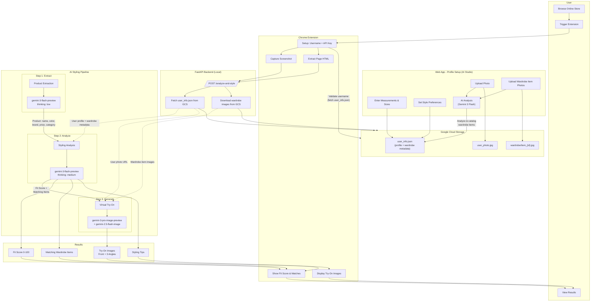
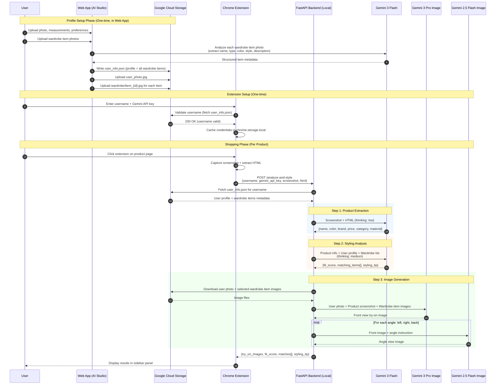
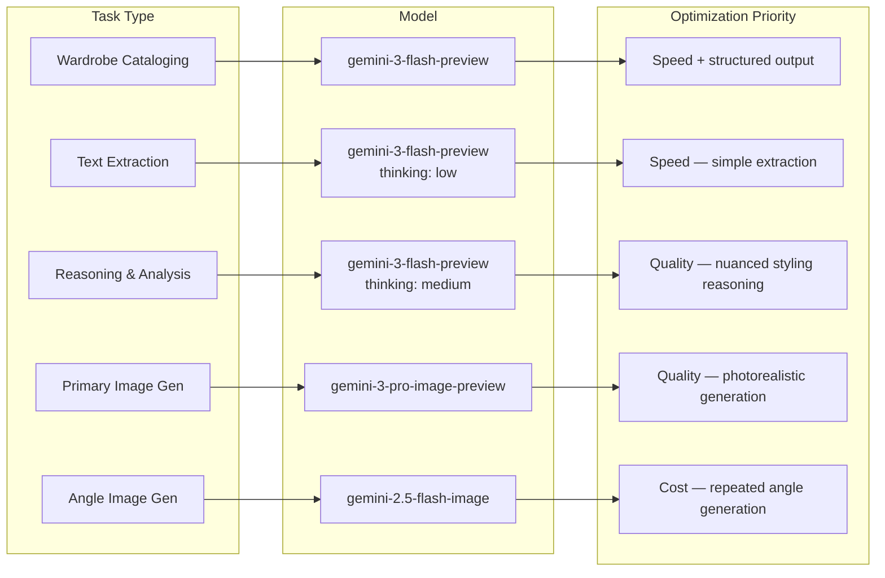
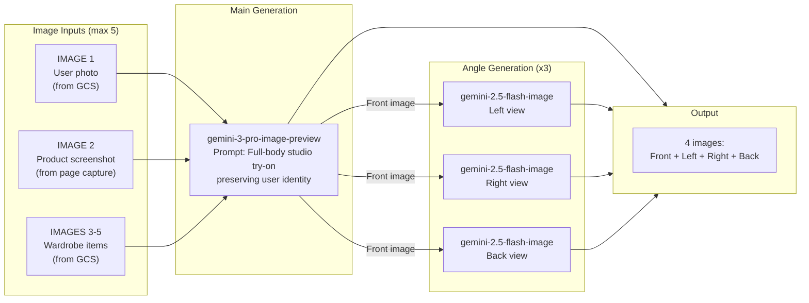
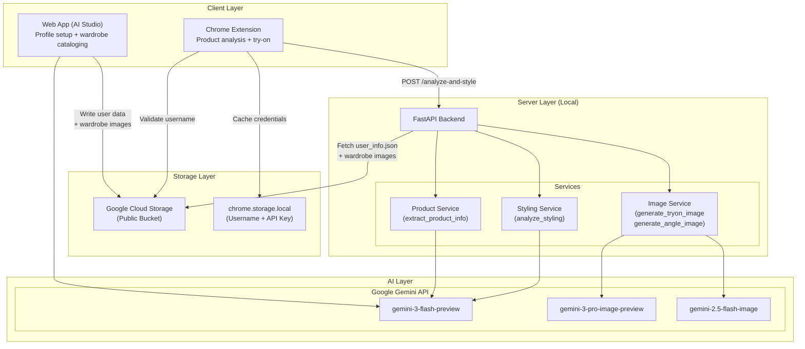

# Spare Room - Technical Architecture

## System Overview

## Data Flow

## LLM Architecture

### Models Used

| Model | Step | Task | Thinking Level | Input | Output |
|-------|------|------|---------------|-------|--------|
| `gemini-3-flash-preview` | Onboarding (Web App) | Wardrobe item analysis | - | Item photo | Name, type, color, hex, style, description |
| `gemini-3-flash-preview` | Step 1: Extract | Product extraction | `low` | Screenshot + HTML | Product name, color, brand, price, category, material |
| `gemini-3-flash-preview` | Step 2: Analyze | Styling analysis | `medium` | Product info + user profile + wardrobe list | Fit score, best matches (1 per category), styling tip |
| `gemini-3-pro-image-preview` | Step 3a: Generate | Main virtual try-on | - | User photo + product screenshot + up to 3 wardrobe item images (max 5 images) | Photorealistic front-view try-on image |
| `gemini-2.5-flash-image` | Step 3b: Angles | Angle view generation | - | Front try-on image + angle instruction | Same outfit from left/right/back (3 calls) |

### Model Selection Strategy

### Image Pipeline Detail

## Component Architecture

## Key Design Decisions

- **API key stays local**: The Gemini API key is stored in chrome.storage.local and passed per-request to the local backend. It never leaves the user's machine.
- **GCS as data layer**: All user data lives in a public GCS bucket, keyed by username. No database needed.
- **Per-request Gemini client**: The backend creates a new Gemini client for each request using the user's API key, rather than a singleton.
- **Web App handles onboarding AI**: Wardrobe item analysis (photo → structured metadata) happens once during profile setup in the AI Studio web app, not in the extension flow.
- **Extension flow is read-only**: The extension only reads from GCS (never writes). All profile/wardrobe mutations happen in the web app.
