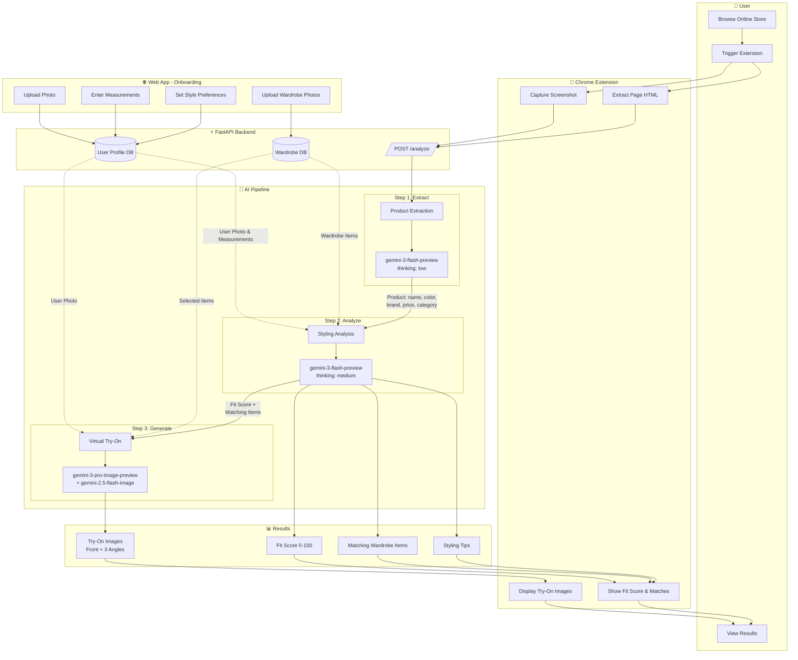
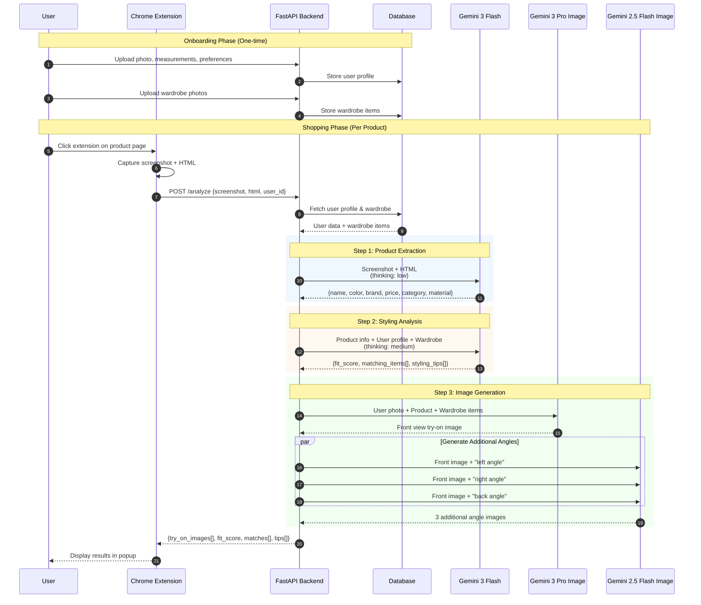
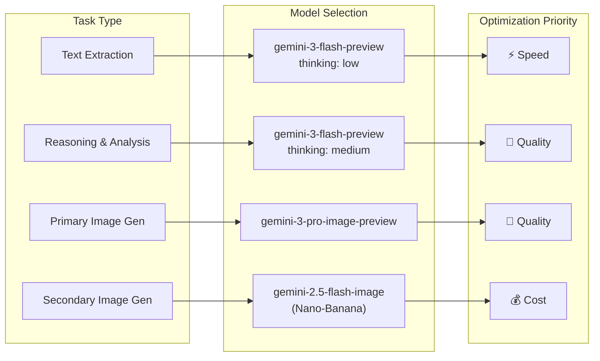
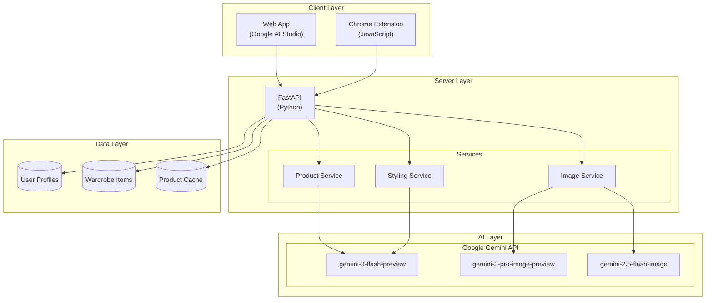
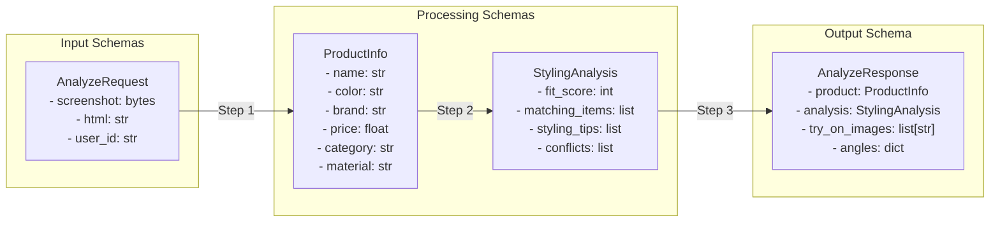

# Spare Room - Technical Architecture

## System Overview

```mermaid
flowchart TB
    subgraph User["👤 User"]
        U1[Browse Online Store]
        U2[Trigger Extension]
        U3[View Results]
    end

    subgraph Onboarding["🌐 Web App - Onboarding"]
        O1[Upload Photo]
        O2[Enter Measurements]
        O3[Set Style Preferences]
        O4[Upload Wardrobe Photos]
    end

    subgraph Extension["🧩 Chrome Extension"]
        E1[Capture Screenshot]
        E2[Extract Page HTML]
        E3[Display Try-On Images]
        E4[Show Fit Score & Matches]
    end

    subgraph Backend["⚡ FastAPI Backend"]
        B1[/POST /analyze/]
        B2[(User Profile DB)]
        B3[(Wardrobe DB)]
    end

    subgraph Pipeline["🤖 AI Pipeline"]
        subgraph Step1["Step 1: Extract"]
            S1[Product Extraction]
            M1["gemini-3-flash-preview<br/>thinking: low"]
        end

        subgraph Step2["Step 2: Analyze"]
            S2[Styling Analysis]
            M2["gemini-3-flash-preview<br/>thinking: medium"]
        end

        subgraph Step3["Step 3: Generate"]
            S3[Virtual Try-On]
            M3["gemini-3-pro-image-preview<br/>+ gemini-2.5-flash-image"]
        end
    end

    subgraph Output["📊 Results"]
        R1[Try-On Images<br/>Front + 3 Angles]
        R2[Fit Score 0-100]
        R3[Matching Wardrobe Items]
        R4[Styling Tips]
    end

    %% Onboarding Flow
    O1 --> B2
    O2 --> B2
    O3 --> B2
    O4 --> B3

    %% Main User Flow
    U1 --> U2
    U2 --> E1
    U2 --> E2
    E1 --> B1
    E2 --> B1

    %% Backend to Pipeline
    B1 --> S1
    B2 -.->|User Photo & Measurements| S2
    B2 -.->|User Photo| S3
    B3 -.->|Wardrobe Items| S2
    B3 -.->|Selected Items| S3

    %% Pipeline Flow
    S1 --> M1
    M1 -->|"Product: name, color,<br/>brand, price, category"| S2
    S2 --> M2
    M2 -->|"Fit Score +<br/>Matching Items"| S3
    S3 --> M3

    %% Output
    M3 --> R1
    M2 --> R2
    M2 --> R3
    M2 --> R4

    %% Results to Extension
    R1 --> E3
    R2 --> E4
    R3 --> E4
    R4 --> E4
    E3 --> U3
    E4 --> U3
```

## Detailed Data Flow

```mermaid
sequenceDiagram
    autonumber
    participant U as User
    participant Ext as Chrome Extension
    participant API as FastAPI Backend
    participant DB as Database
    participant Flash as Gemini 3 Flash
    participant ProImg as Gemini 3 Pro Image
    participant Nano as Gemini 2.5 Flash Image

    Note over U,DB: Onboarding Phase (One-time)
    U->>API: Upload photo, measurements, preferences
    API->>DB: Store user profile
    U->>API: Upload wardrobe photos
    API->>DB: Store wardrobe items

    Note over U,Nano: Shopping Phase (Per Product)
    U->>Ext: Click extension on product page
    Ext->>Ext: Capture screenshot + HTML
    Ext->>API: POST /analyze {screenshot, html, user_id}

    API->>DB: Fetch user profile & wardrobe
    DB-->>API: User data + wardrobe items

    rect rgb(240, 248, 255)
        Note over API,Flash: Step 1: Product Extraction
        API->>Flash: Screenshot + HTML<br/>(thinking: low)
        Flash-->>API: {name, color, brand, price, category, material}
    end

    rect rgb(255, 248, 240)
        Note over API,Flash: Step 2: Styling Analysis
        API->>Flash: Product info + User profile + Wardrobe<br/>(thinking: medium)
        Flash-->>API: {fit_score, matching_items[], styling_tips[]}
    end

    rect rgb(240, 255, 240)
        Note over API,Nano: Step 3: Image Generation
        API->>ProImg: User photo + Product + Wardrobe items
        ProImg-->>API: Front view try-on image

        par Generate Additional Angles
            API->>Nano: Front image + "left angle"
            API->>Nano: Front image + "right angle"
            API->>Nano: Front image + "back angle"
        end
        Nano-->>API: 3 additional angle images
    end

    API-->>Ext: {try_on_images[], fit_score, matches[], tips[]}
    Ext-->>U: Display results in popup
```

## Model Selection Strategy

```mermaid
graph LR
    subgraph Task["Task Type"]
        T1[Text Extraction]
        T2[Reasoning & Analysis]
        T3[Primary Image Gen]
        T4[Secondary Image Gen]
    end

    subgraph Model["Model Selection"]
        M1["gemini-3-flash-preview<br/>thinking: low"]
        M2["gemini-3-flash-preview<br/>thinking: medium"]
        M3["gemini-3-pro-image-preview"]
        M4["gemini-2.5-flash-image<br/>(Nano-Banana)"]
    end

    subgraph Priority["Optimization Priority"]
        P1[⚡ Speed]
        P2[🧠 Quality]
        P3[🎨 Quality]
        P4[💰 Cost]
    end

    T1 --> M1 --> P1
    T2 --> M2 --> P2
    T3 --> M3 --> P3
    T4 --> M4 --> P4
```

## Component Architecture

```mermaid
graph TB
    subgraph Client["Client Layer"]
        WA["Web App<br/>(Google AI Studio)"]
        CE["Chrome Extension<br/>(JavaScript)"]
    end

    subgraph Server["Server Layer"]
        FA["FastAPI<br/>(Python)"]
        subgraph Services["Services"]
            PS[Product Service]
            SS[Styling Service]
            IS[Image Service]
        end
    end

    subgraph AI["AI Layer"]
        subgraph Gemini["Google Gemini API"]
            G3F["gemini-3-flash-preview"]
            G3P["gemini-3-pro-image-preview"]
            G25["gemini-2.5-flash-image"]
        end
    end

    subgraph Data["Data Layer"]
        UP[(User Profiles)]
        WD[(Wardrobe Items)]
        PC[(Product Cache)]
    end

    WA --> FA
    CE --> FA

    FA --> PS
    FA --> SS
    FA --> IS

    PS --> G3F
    SS --> G3F
    IS --> G3P
    IS --> G25

    FA --> UP
    FA --> WD
    FA --> PC
```

## Pydantic Schema Flow

```mermaid
flowchart LR
    subgraph Input["Input Schemas"]
        I1["AnalyzeRequest<br/>- screenshot: bytes<br/>- html: str<br/>- user_id: str"]
    end

    subgraph Intermediate["Processing Schemas"]
        P1["ProductInfo<br/>- name: str<br/>- color: str<br/>- brand: str<br/>- price: float<br/>- category: str<br/>- material: str"]

        P2["StylingAnalysis<br/>- fit_score: int<br/>- matching_items: list<br/>- styling_tips: list<br/>- conflicts: list"]
    end

    subgraph Output["Output Schema"]
        O1["AnalyzeResponse<br/>- product: ProductInfo<br/>- analysis: StylingAnalysis<br/>- try_on_images: list[str]<br/>- angles: dict"]
    end

    I1 -->|"Step 1"| P1
    P1 -->|"Step 2"| P2
    P2 -->|"Step 3"| O1
```
